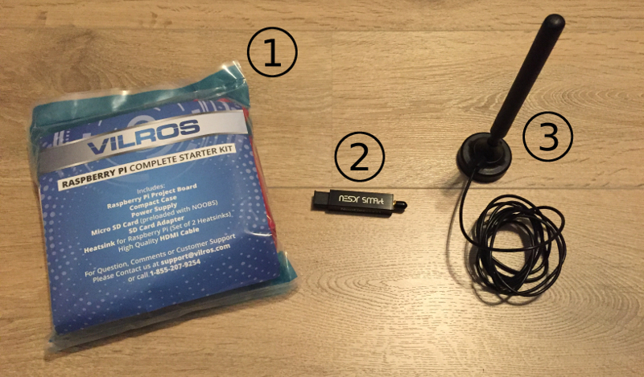

Raspberry Pi ADS-B Base Station for OpenSky Network
===================================================

# Introduction

This guide explains how to assemble a simple ADS-B base station using Raspberry Pi and cheap off-the-shelf components
and how to connect your station to the [OpenSky Network](https://opensky-network.org/).

The proposed base station will be able to receive and decode transponder signals from planes in the radius of up to 600 km.


You will also be able to feed your data into [OpenSky Network](https://opensky-network.org/) and other networks and use it in local applications like [PlanePlotter](http://www.coaa.co.uk/planeplotter.htm).


Instructions below are based on the [ADS-B using dump1090 for the Raspberry Pi](http://www.satsignal.eu/raspberry-pi/dump1090.html) guide.

This guide assumes installation in a home network with internet connection via router like FRITZ!Box.

# Prerequisites

* The most important prerequisite is place with clear view of the sky where you could place the antenna.
* If you want to feed your data into [OpenSky Network](https://opensky-network.org/), you must be able to open and forward ports on your router.
* [OpenSky Network](https://opensky-network.org/) needs a static host name or IP address to connect to your base station.
If you don't have a static IP address (you normally don't), your router must support dynamic DNS using a provider like [No-IP.com](http://www.noip.com/).
* Your router must support WiFi so that you could connect Raspberry Pi to the network wirelessly.

# Inventory



* (1) Raspberry Pi set
  * Raspberry Pi 3 Board
  * Case
  * Power Supply
  * Micro SD Card + Adapter
  * Heatsink
  * HDMI Cable
* (2) Optimized RTL-SDR Receiver
* (3) ADS-B Antenna with *SMA Male* Connector
  
## Notes on the inventory and installation

* There should be a NOOBS Raspbian pre-installed on the SD card
* If you connect the receiver to one of the USB port on Raspberry Pi directly, it will cover other ports. You can avoid this using the USB extension cable.
* You should consider using a USB extension cable rather than a antenna extension cable to keep the signal quality as high as possible
* This installation guide installs the MalcolmRobb version of dump1090. If you want a newer version, we recommend using the mutability fork (https://github.com/mutability/dump1090). Installation should be more or less the same. Just adopt the git url in the setup-dump1090.sh file.

# Overview of the installation steps

* Assemble the Raspberry Pi
* Connect the components
* Setup the Raspberry Pi
  * Build and install drivers for the RTL-SDR receiver
  * Build and install the `dump1090` decoder
* Connect your base station to the OpenSky Network
  * Set up dynamic DNS for your Raspberry Pi
  * Make the port `30005` port accessible from the internet
  * Create an OpenSky Network account
  * Configure a new sensor in OpenSky Network

# Assemble the Raspberry Pi

* Attach heatsinks to chips
* Fix the Raspberry Pi to the case using screws, close the case
* Insert SD card

# Connect the components

Antenna -- NooElec RTL-SDR -- Raspberry Pi -- Internet

# Setup Raspberry Pi

## Set up RTL-SDR drivers and `dump1090`

### Check out the `raspberry-pi-adsb` project

```
cd ~
git clone https://github.com/openskynetwork/raspberry-pi-adsb.git
chmod +x ~/raspberry-pi-adsb/*.sh
```

### Set up RTL-SDR drivers

Check out, build and install drivers for the RTL-SDR receiver:

```
cd ~/raspberry-pi-adsb
./setup-rtl-sdr.sh
```

You will be prompted to reboot after the set up.

After the system rebooted, you can check the RTL-SDR connection by running:

```
rtl_test
```

You should be seeing something like:

```
Found 1 device(s):
  0:  Realtek, RTL2838UHIDIR, SN: 00000001

Using device 0: Generic RTL2832U OEM
Found Rafael Micro R820T tuner
Supported gain values (29): 0.0 0.9 1.4 2.7 3.7 7.7 8.7 12.5 14.4 15.7 16.6 19.7 20.7 22.9 25.4 28.0 29.7 32.8 33.8 36.4 37.2 38.6 40.2 42.1 43.4 43.9 44.5 48.0 49.6 
[R82XX] PLL not locked!
Sampling at 2048000 S/s.

Info: This tool will continuously read from the device, and report if
samples get lost. If you observe no further output, everything is fine.

Reading samples in async mode...
```

This means RTL-SDR drivers were compiled and installed successfully.

### Set up `dump1090`

[`dump1090`](https://github.com/MalcolmRobb/dump1090) decodes signals coming from the RTL-SDR receiver.

Check out, build and install `dump1090`:

```
cd ~/raspberry-pi-adsb
./setup-dump1090.sh
```
The `setup-dump1090.sh` also installs `dump1090` was as a service so that `dump1090` starts automatically after system restart.

You will be once again prompted to reboot after the set up. 

After the system rebooted, you might want to check if `dump1090` is running correctly. Just go to `http://127.0.0.1:8080` in the browser on Raspberry Pi, you should see a map with planes.


Alternatively, you can start `dump1090` in the interactive mode from the command line. To do this, first stop the running `dump1090` service:

```
sudo /etc/init.d/dump1090.sh stop
```

Now start the `dump1090` in the interactive mode:

```
~/dump1090/dump1090 --interactive --gain -10 --net --net-beast
```

You should be getting output like:

```
Hex     Mode  Sqwk  Flight   Alt    Spd  Hdg    Lat      Long   Sig  Msgs   Ti|
-------------------------------------------------------------------------------
3C4B4C  S                    34000  470  344                      5    39    1
44D076  S                    25000                                4     5    1
3C66B3  S     2037  DLH8YA   19475  339  121   48.916   11.190    4    27    5
040032  S     2540  ETH707    5875  273  119   49.905    8.698    8   113    0
3C6DCD  S     7610           31000  465  108                      4    12    1
44A8A2  S     1000  JAF83X   34625  454  292                      5   130    2
710105  S     2702  SVA116   33000  510  125   49.382    7.167    4   156    1
...
```

Finally, start the `dump1090` service again:

```
sudo /etc/init.d/dump1090.sh start
```

# Connecting your base station to the OpenSky Network

To connect your base station to the OpenSky Network you must make the port `30005` on your Raspberry Pi available from the internet via static host or IP address.

The guide below illustrates configuration on the home network behind the FRITZ!Box 7490 router. I am sorry that the screenshots are in German, I can't easily switch interface language of my router.

## Configure the Raspberry Pi device on your Network

* Give Raspberry Pi a name (I'll use `argon` for example)
* Select "Always use the same IP address"


Now you should be able to reach the `dump1090` instance running on the Raspberry Pi via `http://argon:8080`.

You should also be able to connect to the port `30005` (for instance via Putty) and see some binary data coming from the Raspberry Pi.

## Configure dynamic DNS

Condiguring dynamic DNS via provider like [No-IP.com](http://www.noip.com/) will give you a static host name even for dynamically assigned IP addresses.

* Create a [No-IP.com](http://www.noip.com/) account - I'll use `argon-adsb` username for example
* Create a new hostname - I'll use `argon-adsb.ddns.net` for example  

* Configure dynamic DNS in your router  


## Configure port forwarding

You will need to make the port `30005` on your Raspberry Pi avaliable from the internet. For this, configure the forwaring of the `30005` to the `argon` host (Raspberry Pi).


Now you should be able to connect to `argon-adsb.ddns.net:30005` via Putty and see a binary stream coming from `dump1090` on the Raspberry Pi.

Additionally, you can also forward the port `8080` to `argon:8080` so that you could access the web-interface of `dump1090` via `http://argon-adsb.ddns.net:8080`.

## OpenSky Network configuration

* Create an OpenSky Network account
* Add a new sensor: `My OpenSky` > `My Sensors` > `Add Sensor`
* Receiver Type: `dump1090`
* Hostname: `argon-adsb.ddns.net`
* Port: `30005`
* Enter or pick your location
* Submit


Now you should see your sensor on the map. If everything's fine, the sensor should go online in a couple of minutes.


# Credits

* This guide is largely based on the [ADS-B using dump1090 for the Raspberry Pi](http://www.satsignal.eu/raspberry-pi/dump1090.html) guide
* This guide uses RTL-SDR drivers from the [osmocomSDR](http://sdr.osmocom.org/trac/wiki/rtl-sdr) project
* We use the [Malcolm Robb's fork](https://github.com/MalcolmRobb/dump1090) of the [`dump1090`](https://github.com/antirez/dump1090) software
* This guide is an adapted version of [highsource's guide](https://github.com/openskynetwork/raspberry-pi-adsb/).

# License

This guide is published under the [MIT license](LICENSE).
